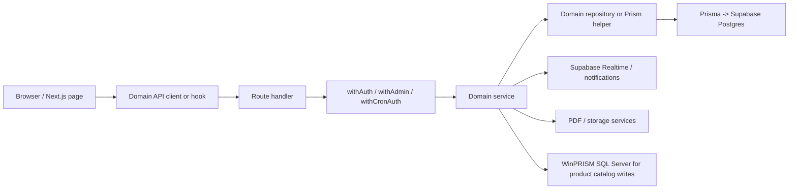

# LAPortal - Project Overview

LAPortal is the operations portal for Los Angeles Pierce College. The codebase now reflects the final eight-phase product set: invoice and quote workflows, the product catalog and bulk-edit workspace, staff and calendar tools, textbook requisitions, admin and analytics views, archive browsing, pricing tools, notifications, PDFs, and the Prism-backed item editor parity work.

This document is the canonical architecture and route map. If you are trying to understand how the app works end to end, start here.

## Architecture At A Glance

The codebase follows a domain-module pattern:

- route handlers validate inputs and enforce auth
- domain services own business rules
- repositories wrap Prisma or platform clients
- client components consume typed api-clients and hooks
- public or cron-only routes are explicitly carved out in middleware

## Repository Layout

| Path | Purpose |
| --- | --- |
| `src/app/` | App Router pages and route handlers |
| `src/components/` | UI components grouped by feature |
| `src/domains/` | Domain services, repositories, API clients, and hooks |
| `src/lib/` | Shared utilities, auth, PDF, storage, rate limiting, Prisma, Supabase, and build metadata helpers |
| `prisma/` | Prisma schema, migrations, and seed data |
| `scripts/` | Deployment, audit, sync, and Prism discovery scripts |
| `docs/` | Canonical docs, historical phase plans/specs, and operational handoffs |
| `supabase/` | Supabase bootstrap SQL and setup notes |

## Authentication And Access

- NextAuth credentials remain the session authority.
- `middleware.ts` redirects unauthenticated users to `/login` and unauthenticated setup traffic to `/setup`.
- `withAuth()` protects authenticated team routes.
- `withAdmin()` gates admin-only routes and bulk product operations.
- `withCronAuth()` protects internal cron and platform inspection routes.

The middleware explicitly exempts:

- `/login`
- `/setup`
- public quote review and payment routes
- public follow-up and account-request forms
- `/api/version`
- internal cron routes
- static Next.js assets

## Application Routes

### Public And Setup

- `/login` - credentials login page
- `/setup` - first-user onboarding and profile setup
- `/account-request/[token]` - public account-number follow-up form
- `/quotes/review/[token]` - public quote review and response page
- `/quotes/payment/[token]` - public quote payment-details page
- `/pricing-calculator` - public print pricing calculator
- `/api/version` - build metadata and public env health
- `/api/follow-ups/public/[token]` - public follow-up summary lookup
- `/api/follow-ups/public/[token]/submit` - submit an account number
- `/api/quotes/public/[token]` - fetch a public quote by share token
- `/api/quotes/public/[token]/view` - record a public quote view
- `/api/quotes/public/[token]/view/[viewId]` - update view duration
- `/api/quotes/public/[token]/respond` - approve or decline a quote
- `/api/textbook-requisitions/submit` - public faculty submission flow

### Team Dashboard And Shared Workspaces

- `/` - personalized dashboard
- `/invoices` - invoice list
- `/invoices/new` - invoice editor
- `/invoices/[id]` - invoice detail
- `/invoices/[id]/edit` - invoice edit
- `/quotes` - quote list
- `/quotes/new` - quote editor
- `/quotes/[id]` - quote detail
- `/quotes/[id]/edit` - quote edit
- `/calendar` - calendar view and event editor
- `/staff` - staff directory
- `/analytics` - analytics dashboard
- `/archive` - archived invoices and quotes

### Product Catalog And Editor Parity

- `/products` - Prism-backed catalog browser
- `/products/batch-add` - batch create workspace for general-merchandise items
- `/products/bulk-edit` - bulk edit workspace with preview/commit/audit flow
- `/api/products/refs` - live Prism refs with snapshot fallback
- `/api/products/dcc-list` - DCC list from the Supabase mirror
- `/api/products/health` - Prism reachability probe
- `/api/products/history-check` - hard-delete guard
- `/api/products/batch` - batch create, update, discontinue, and hard delete
- `/api/products/validate-batch` - dry validation for batch operations
- `/api/products/views` - saved product views and system presets
- `/api/products/views/[id]` - delete a saved user view
- `/api/products/[sku]` - soft delete, hard delete, and patch a product
- `/api/products/[sku]/hard-delete` - hard delete a real item with history guard
- `/api/products/bulk-edit/dry-run` - preview a bulk transform
- `/api/products/bulk-edit/commit` - commit a bulk transform and record a run
- `/api/products/bulk-edit/runs` - list bulk-edit runs
- `/api/products/bulk-edit/runs/[id]` - bulk-edit run detail

### Textbook Requisitions

- `/textbook-requisitions` - requisition list
- `/textbook-requisitions/new` - staff create flow
- `/textbook-requisitions/[id]` - requisition detail
- `/textbook-requisitions/[id]/edit` - requisition edit
- `/textbook-requisitions/submit` - faculty submit flow
- `/api/textbook-requisitions` - list, create, and bulk archive
- `/api/textbook-requisitions/lookup` - public lookup support
- `/api/textbook-requisitions/export` - export
- `/api/textbook-requisitions/[id]/notify` - notify flow

### Admin And Utilities

- `/admin/users` - user management
- `/admin/settings` - arbitrary JSON settings
- `/admin/pricing` - print pricing admin
- `/quick-picks` - quick-pick manager
- `/api/categories` - category list used by invoice and quote forms
- `/api/admin/*` - account-code, invoice, quote, pricing, settings, user, and db-health admin routes
- `/api/analytics` - analytics data
- `/api/archive` - archive listing
- `/api/chat` - streaming assistant endpoint
- `/api/events` - manual calendar event CRUD
- `/api/notifications` - notification list
- `/api/notifications/read-all` - bulk mark notifications read
- `/api/notifications/stream` - realtime notification stream
- `/api/notifications/[id]` - single notification action
- `/api/print-pricing` - print pricing state
- `/api/quick-picks` - admin quick-pick catalog
- `/api/saved-items` - saved line-item catalog
- `/api/saved-searches` - saved search presets
- `/api/realtime/token` - browser realtime token bridge
- `/api/setup` - first-user setup commit
- `/api/staff` - staff CRUD
- `/api/templates` - document templates
- `/api/user-quick-picks` - per-user quick picks
- `/api/upload` - upload handling
- `/api/me/drafts` and `/api/me/preferences/[key]` - personal draft and preference storage
- `/api/internal/jobs/*` - cron job entrypoints
- `/api/internal/platform/*` - storage and scheduler inspection routes

## Major Workflows

### Invoices

Invoice pages are authenticated and team-visible. Draft and pending-charge invoices remain editable; final invoices are not. The invoice service owns numbering, line-item math, tax/margin calculations, PDF generation, duplicate handling, and finalization. `GET /api/invoices` supports filter and stats modes, while `POST /api/invoices` creates a new draft invoice.

Important internal pieces:

- `src/domains/invoice/service.ts` - business rules and persistence orchestration
- `src/domains/invoice/repository.ts` - Prisma access
- `src/components/invoice/*` - form state, keyboard mode, line items, and PDF progress UI
- `src/lib/pdf/*` - PDF generation and merge helpers

### Quotes

Quotes mirror the invoice lifecycle but add public sharing and response tracking. Draft quotes can be edited, sent, duplicated, revised, declined, or converted to invoices. Public quote links record views and capture approve/decline responses without authentication. Payment details are a separate step before conversion.

Important endpoints:

- `GET/POST /api/quotes`
- `GET/PATCH/DELETE /api/quotes/[id]`
- `POST /api/quotes/[id]/send`
- `POST /api/quotes/[id]/approve`
- `POST /api/quotes/[id]/decline`
- `POST /api/quotes/[id]/convert`
- `POST /api/quotes/[id]/revise`
- `POST /api/quotes/[id]/payment-details`
- public `/api/quotes/public/*`

### Products And Prism Integration

This is the newest major surface and it is intentionally label-first.

- `/api/products/refs` tries Prism first and falls back to the committed snapshot at `docs/prism/ref-data-snapshot-2026-04-19.json` on failure.
- The refs payload now includes vendors, DCCs, tax types, tag types, status codes, package types, colors, and bindings.
- The UI always renders labels when a ref label exists. Numeric IDs are submitted, not shown.
- Pierce-scoped product data is limited to LocationIDs 2, 3, and 4. PBO / LocationID 5 is excluded everywhere.
- `/products` uses the Prism health probe to decide whether write actions should appear.
- Batch add writes new general-merchandise items to Prism and then mirrors them into the Supabase `products` table.
- Bulk edit uses a dry-run preview first, then commits via `/api/products/batch`, then records a `bulkEditRun`.
- Saved views are persisted in the database, and system presets are seeded from `src/domains/product/presets.ts`.

Supporting files:

- `src/domains/product/prism-server.ts` - live Prism read/write helpers
- `src/domains/product/prism-sync.ts` - sync orchestration
- `src/domains/product/ref-data-server.ts` - committed snapshot fallback loader
- `src/domains/product/ref-data.ts` - ref-label normalization
- `src/domains/product/server-views.ts` - saved view persistence
- `src/domains/product/view-serializer.ts` - query-string parsing and preset application
- `src/components/products/*` - catalog table, dialogs, views, and sync controls

### Calendar, Notifications, And Jobs

The calendar page merges manual events, catering events derived from quotes, and staff birthdays. Internal jobs send event reminders, payment follow-ups, and account follow-ups through the app or Supabase cron depending on scheduler mode. Background runs are tracked in the database and surfaced in admin health.

Relevant files:

- `src/domains/event/*`
- `src/domains/follow-up/*`
- `src/domains/quote/follow-ups.ts`
- `src/lib/job-runs.ts`
- `src/lib/job-scheduler.ts`
- `src/lib/supabase-scheduler.ts`

### Chat, Archive, Analytics, And Admin

- The AI sidebar streams from `POST /api/chat` using Claude Haiku and domain tools.
- `/archive` exposes archived invoices and quotes with role-aware visibility.
- `/analytics` aggregates business metrics.
- `/admin/*` manages users, settings, pricing, and database health.

## Data Model Highlights

| Model | Purpose |
| --- | --- |
| `User` | App accounts, roles, and setup state |
| `Staff` | Pierce staff directory with account-number history |
| `Invoice` / `InvoiceItem` | Invoice records and line items |
| `Quote` / `QuoteItem` | Quote records, revisions, public sharing, and conversion |
| `Event` | Manual calendar events and reminders |
| `Notification` | Realtime notification records |
| `Contact` | Owner-scoped external people records |
| `SavedSearch` | Saved product views and other reusable filters |
| `QuickPick` / `UserQuickPick` | Reusable line-item helpers |
| `TextbookRequisition` | Textbook request workflow records |
| `BulkEditRun` | Bulk-edit audit trail |
| `JobRun` | Background-job execution ledger |
| `RateLimitEvent` | Shared rate-limiting ledger |

## Security And Operational Guarantees

- `escapeHtml()` protects all PDF template interpolation.
- Puppeteer PDF rendering blocks external network requests.
- Storage keys are normalized before writes.
- Login and chat rate limiting is stored in Postgres, not in process memory.
- `withAuth()` / `withAdmin()` centralize route-level authorization.
- `withCronAuth()` guards internal job and platform routes.
- Build metadata is exposed through `/api/version`, and production deploys verify that endpoint after restart.

## Deployment And Runtime

- Production deploys run exact-SHA image builds.
- `/api/version` reports build SHA, build time, and whether public Supabase env was present at build time.
- `JOB_SCHEDULER` defaults to app-owned cron and can be shifted to Supabase once confirmation is intentional.
- The app keeps legacy filesystem storage fallback off by default.
- `npm run ship-check` is the normal local release gate.
- `npm run hotfix:deploy -- <ref>` is the fast SSH lane for small production fixes.

## Historical Material

The following directories are retained for traceability, but they are not the active source of truth for current runtime behavior:

- `docs/superpowers/specs/`
- `docs/superpowers/plans/`
- `docs/prism/phase-1-verification-2026-04-19.md`
- `docs/QUOTE-INVOICE-WORKFLOW-AUDIT-2026-04-08.md`

For current implementation questions, prefer the app code and the docs in the "Start Here" section of [docs/README.md](README.md).
